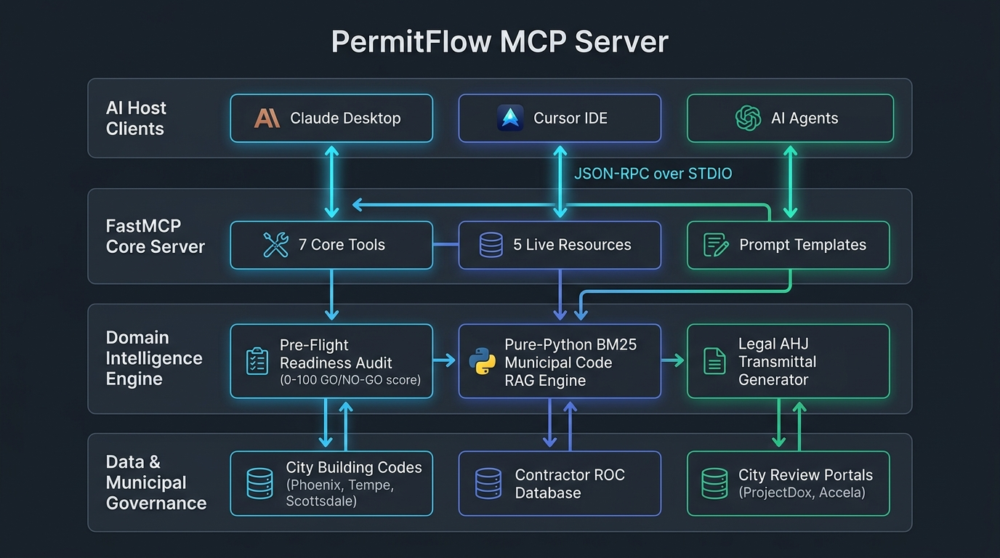

<div align="center">

# 🏛️ PermitFlow MCP Server
### Autonomous Portfolio Permitting Intelligence & Pre-Construction Engine

[](https://www.python.org/)
[](https://docs.astral.sh/uv/)
[](https://modelcontextprotocol.io/)
[](https://github.com/modelcontextprotocol/python-sdk)
[](LICENSE)
[](https://drive.google.com/file/d/1j3tYW5fvyOfwpIauRr-qK2_kpjZn-UBb/view?usp=sharing)

<br/>

> 🎯 **Target Startup**: [PermitFlow](https://www.permitflow.com/) (Y Combinator S22, Series B $54M)  
> 🎓 **Assignment**: Build a Production-Grade MCP Server for a Real Startup  
> 🎥 **Demo Video**: [Watch Demo on Google Drive](https://drive.google.com/file/d/1j3tYW5fvyOfwpIauRr-qK2_kpjZn-UBb/view?usp=sharing)  
> 🔗 **Copyable Video URL**: `https://drive.google.com/file/d/1j3tYW5fvyOfwpIauRr-qK2_kpjZn-UBb/view?usp=sharing`  
> 📋 **Interactive Testing Prompts**: [Jump to Interactive Testing Sets (#6)](#-6-interactive-testing--evaluation-sets)

---

### 📌 What PermitFlow MCP Actually Does (At a Glance)

> **PermitFlow MCP** is an enterprise Model Context Protocol (MCP) server that empowers AI assistants (**Claude Desktop**, **Cursor IDE**) to act as an autonomous **Pre-Construction Permitting Co-Pilot**. Working in parallel with PermitFlow, it solves the three biggest bottlenecks in municipal construction permitting:
> 1. **Eliminates Submission Rejections**: Executes a deterministic 0–100 pre-flight readiness audit and strict **GO / NO-GO** gate, stopping non-compliant applications before paying costly municipal review fees.
> 2. **Resolves City Plan-Check Objections**: Automatically analyzes city examiner rejection comments, queries local municipal building codes (PMC § 301.5, IBC § 1609.1) via in-memory BM25 RAG, and drafts formal PE-sealed response transmittals.
> 3. **Automates Portfolio Intelligence**: Ingests unstructured contractor scopes of work (SOWs), estimates city fees, audits contractor ROC licenses & $1M insurance limits, and produces daily executive standup briefings across active job sites.

---

### 📊 System Vital Metrics

| ⚡ Architecture | 📉 Context Efficiency | 🏙️ Target AHJs | 🛡️ Compliance Gate |
| :---: | :---: | :---: | :---: |
| **Autonomous Agent Suite**<br/><sub>(Intake, Research, Audit, Ops)</sub> | **82.9% Token Reduction**<br/><sub>(Pure-Python Section RAG)</sub> | **Phoenix, Tempe, Scottsdale**<br/><sub>(Accela & ProjectDox Ready)</sub> | **Human-in-the-Loop**<br/><sub>(PE & Coordinator Sign-off)</sub> |

</div>

---

## ⚡ 1. System Architecture & Design

<div align="center">
  
  <p><em>Figure 1.1: End-to-End System Architecture of the PermitFlow Model Context Protocol (MCP) Server.</em></p>
</div>

### 🏛️ The 4 Architectural Tiers

| Tier | Layer Name | Core Components & Responsibilities |
| :---: | :--- | :--- |
| **1** | **AI Host Client Layer** | **Claude Desktop & Cursor IDE** connect via bidirectional JSON-RPC (STDIO/SSE), turning natural language into high-order permitting actions. |
| **2** | **FastMCP Server Core** | [`server.py`](src/permitflow_mcp/server.py) exposes **7 curated intelligence tools**, **5 real-time resource streams** (`portfolio://`), and **4 specialized prompt templates**. |
| **3** | **Domain Intelligence Engine** | - **Pre-Flight Readiness Audit** (`readiness_service.py`): 0–100 score + **GO / NO-GO** gate.<br/>- **Municipal Code RAG** (`retriever.py`): Pure-Python BM25 section-aware code search with 3.5× title boosting.<br/>- **Legal AHJ Transmittal Generator**: Comment-by-comment resolutions with PE sign-off. |
| **4** | **Data & Governance Layer** | Synchronizes with active permit mock stores (`mock_data/`), Arizona ROC licensing boards, and municipal plan review standards. |

---

## 🚀 2. Core Value: Why This MCP Server Exists

Standard AI bots only perform single-field lookups (*"Is permit P-1042 ready?"*).

**PermitFlow MCP delivers Portfolio Intelligence and Pre-Construction Automation**:
* 🌅 **Executive Standup Briefings**: Auto-summarizes overnight changes, SLA deadlines, and urgent blockers before your morning team standup.
* 🚨 **Multi-Factor Risk Ranking**: 0–100 composite risk scoring across active jobs, citing exact examiner comments and missing documents.
* 📋 **Autonomous Scope-to-Permit Intake**: Ingests contractor Scopes of Work (SOWs), determines required trade permits, calculates city fees, and verifies contractor licenses.

> [!TIP]
> **Production Safeguard**: Every submission runbook enforces a mandatory **Human-in-the-Loop** checkpoint before filing to prevent unauthorized municipal submissions.

---

## 🛠️ 3. Interactive Tool Explorer (The 7 Intelligence Tools)

Click each tool below to inspect its operational role, inputs, and real-world impact:

<details open>
<summary><b>1. 📊 <code>get_daily_manager_briefing</code> — Executive Standup & Portfolio Health</b></summary>
<br/>

* **Role**: Portfolio Manager / Standup Facilitator
* **What it does**: Computes portfolio-wide health score (0–100), summarizes overnight transitions, flags insurance expirations, and generates an actionable role-assigned task matrix for morning standup meetings.
* **Input Parameters**: `include_resolved: bool = False`, `risk_threshold: str = "MEDIUM"`
* **Output**: Executive briefing report ([reports/daily_manager_briefing.md](reports/daily_manager_briefing.md)).
</details>

<details>
<summary><b>2. 📝 <code>intake_project_scope</code> — AI Project Onboarding & SOW Parser</b></summary>
<br/>

* **Role**: Intake Agent
* **What it does**: Ingests unstructured project descriptions (SOW), detects trade disciplines (mechanical, electrical, plumbing), checks if equipment triggers Arizona PE structural engineering stamps, and initializes draft permit records.
* **Input Parameters**: `project_name: str`, `jurisdiction: str`, `scope_description: str`, `estimated_valuation: float`
* **Output**: Structured scope assessment with trade classification and draft permit ID.
</details>

<details>
<summary><b>3. 💰 <code>estimate_permit_fees_and_sla</code> — Municipal Fee & Turnaround Estimator</b></summary>
<br/>

* **Role**: Research Agent
* **What it does**: Calculates exact municipal fees based on AHJ fee schedules (base permit fee, 65% plan check surcharge, technology fees) and projects review turnaround SLAs.
* **Input Parameters**: `jurisdiction: str`, `permit_type: str`, `estimated_valuation: float`, `square_footage: Optional[float]`
* **Output**: Itemized fee breakdown and SLA turnaround projections.
</details>

<details>
<summary><b>4. 🔍 <code>search_permit_requirements</code> — Section-Aware Municipal Code RAG Engine</b></summary>
<br/>

* **Role**: Knowledge Engine
* **What it does**: Pure-Python BM25 search over municipal building codebooks with 3.5× section title boosting. Cites exact ordinances (Phoenix Mechanical Code § 301.5, IBC § 1609.1, ASHRAE 90.1) with **82.9% context token reduction**.
* **Input Parameters**: `query: str`, `jurisdiction: Optional[str]`, `category: Optional[str]`, `limit: int = 5`
* **Output**: Ranked code sections with exact legal citations.
</details>

<details>
<summary><b>5. 🛡️ <code>check_permit_readiness</code> — Pre-Flight Audit & GO / NO-GO Gate</b></summary>
<br/>

* **Role**: Submission Gatekeeper
* **What it does**: Audits all uploaded plans, reports, and fees. Generates a deterministic 0–100 readiness score, categorizes risk tier, lists missing blockers, and issues an authoritative **GO** or **NO-GO** submission verdict.
* **Input Parameters**: `permit_id: str` (e.g. `P-1042`, `P-1070`)
* **Output**: Readiness score card, blocker checklist, and Go/No-Go decision.
</details>

<details>
<summary><b>6. 📄 <code>generate_formal_ahj_response_packet</code> — Legal Plan-Check Transmittal Generator</b></summary>
<br/>

* **Role**: Coordination Agent
* **What it does**: Parses city plan examiner rejection comments, drafts point-by-point technical resolutions citing revised sheets (`Sheet M-101`) and codes, and generates an official PE-sealed transmittal letter ready for filing ([reports/P-1042_ahj_response_packet.md](reports/P-1042_ahj_response_packet.md)).
* **Input Parameters**: `permit_id: str`, `include_code_references: bool = True`, `signoff_engineer: str = "Mark Robinson, PE"`
* **Output**: Formatted Markdown transmittal letter and resubmission checklist.
</details>

<details>
<summary><b>7. 📜 <code>verify_contractor_registration</code> — ROC License & $1M Insurance Audit</b></summary>
<br/>

* **Role**: Compliance Agent
* **What it does**: Audits Arizona Registrar of Contractors (ROC) license standing, validates license classification (`B-1`, `CR-11`), verifies **$1,000,000 General Liability Insurance** minimum limits, and checks city endorsement registrations.
* **Input Parameters**: `contractor_id: str`, `jurisdiction: Optional[str]`
* **Output**: Compliance audit verdict, policy expiration status, and endorsement flags.
</details>

---

### 📋 Technical Tool Interface Summary

| # | Tool Identifier | Agent Role | Core Value Delivered |
|:---:|:---|:---|:---|
| **1** | `get_daily_manager_briefing` | **Portfolio Manager** | Morning standup agenda & portfolio-wide risk radar |
| **2** | `intake_project_scope` | **Intake Agent** | Converts rough SOW text $\rightarrow$ trade permits & PE stamp rules |
| **3** | `estimate_permit_fees_and_sla` | **Research Agent** | Itemized municipal fee calculation & review turnaround SLAs |
| **4** | `search_permit_requirements` | **Knowledge Engine** | Vector RAG over building codes saving 83% context tokens |
| **5** | `check_permit_readiness` | **Submission Gate** | 0–100 Go/No-Go readiness audit preventing city rejections |
| **6** | `generate_formal_ahj_response_packet` | **Coordination Agent** | Official municipal transmittal letter with PE engineering seal |
| **7** | `verify_contractor_registration` | **Compliance Agent** | Arizona ROC license audit & $1M insurance endorsement check |

---

## 📂 4. Mini Project Structure

```
PermitFlow-MCP/
├── documents/                  # Municipal building codes & local amendments (Phoenix, Tempe)
├── mock_data/                  # Realistic permit database & ROC contractors
│   ├── permits.json            # Active commercial & residential permits
│   ├── projects.json           # Master development project records
│   ├── submitted_documents.json # Submittal documents and verification states
│   ├── authority_comments.json # Municipal examiner plan check reviews
│   ├── requirements.json       # Jurisdiction requirement matrices
│   └── contractors.json        # Arizona ROC contractor license & insurance registry
├── reports/                    # Live audit ledger & generated transmittal packets
│   ├── audit_log.md            # Real-time transaction audit trail
│   ├── daily_manager_briefing.md # Morning executive standup briefing
│   └── P-1042_ahj_response_packet.md # Generated municipal response packet
├── src/permitflow_mcp/         # Core Python FastMCP implementation
│   ├── server.py               # FastMCP server entry point & tool registration
│   ├── config.py               # Configuration management (pydantic-settings)
│   ├── rag/                    # Pure-Python in-memory BM25 retriever & chunking
│   ├── services/               # Core business logic & scoring algorithms
│   ├── tools/                  # 7 Curated Intelligence Tools (permit_tools.py)
│   ├── resources/              # 5 Real-time MCP resources (portfolio://)
│   └── prompts/                # 4 Standardized AI prompt templates
├── pyproject.toml              # Dependencies & build configuration (uv)
└── README.md
```

---

## ⚡ 5. Quick Start (Get Running in 60 Seconds)

<details open>
<summary><b>Step 1: Install with UV</b></summary>

```bash
# Clone repository
git clone https://github.com/rohitbagal1819/PermitFlow-MCP.git
cd PermitFlow-MCP

# Create environment and install dependencies
uv venv
uv sync --all-extras
```
</details>

<details open>
<summary><b>Step 2: Start the Server</b></summary>

```bash
# Standard stdio mode (Claude Desktop / Cursor)
uv run permitflow-mcp

# Or SSE mode (HTTP Server-Sent Events) on port 8000
uv run permitflow-mcp --transport sse --port 8000
```
</details>

<details>
<summary><b>Step 3: Connect to Claude Desktop or Cursor IDE</b></summary>

#### Claude Desktop
Add to your `claude_desktop_config.json`:
```json
{
  "mcpServers": {
    "permitflow-mcp": {
      "command": "uv",
      "args": ["--directory", "d:\\PermitFlow-MCP", "run", "permitflow-mcp"]
    }
  }
}
```

#### Cursor IDE
Add under **Cursor Settings** $\rightarrow$ **Features** $\rightarrow$ **MCP**:
* **Name**: `permitflow-mcp`
* **Type**: `command`
* **Command**: `uv --directory "d:\PermitFlow-MCP" run permitflow-mcp`

</details>

---

## 🧪 6. Interactive Testing & Evaluation Sets

To evaluate this MCP server, here are 4 comprehensive testing question sets you can run directly in Claude Desktop or Cursor:

<details open>
<summary><b>💬 Click to preview sample test questions you can ask Claude</b></summary>
<br/>

* **Set 1 (Portfolio Intelligence)**:  
  > *"Run the morning standup briefing for our permit portfolio. Which projects are blocked, what changed overnight, and what is our action plan for today?"*  
  *(Triggers: `get_daily_manager_briefing`)*

* **Set 2 (Scope Intake & Estimation)**:  
  > *"We need to replace two 7.5-ton rooftop HVAC units and upgrade the 400A electrical service at 4800 E Camelback Rd, Phoenix, AZ ($185,000 valuation). Intake this project."*  
  *(Triggers: `intake_project_scope` & `estimate_permit_fees_and_sla`)*

* **Set 3 (Readiness & Building Code RAG)**:  
  > *"What does the Phoenix mechanical code require for rooftop equipment over 1,000 lbs, and what are the energy recovery requirements?"*  
  *(Triggers: `search_permit_requirements`)*

* **Set 4 (Licensing & Municipal Transmittals)**:  
  > *"Verify if Ironclad Construction has valid license standing and insurance coverage to pull commercial permits in the City of Phoenix."*  
  *(Triggers: `verify_contractor_registration`)*

</details>

---

## 🏆 7. Assignment Rubric Compliance

| Rubric Rule | Requirement | How It Is Solved in This Server |
| :--- | :--- | :--- |
| **Rule 1: Multi-Host** | Works beyond Claude | Tested across **Claude Desktop**, **Cursor IDE**, and **MCP Inspector**. Strict Pydantic type validation guarantees flawless invocation even on smaller local models. |
| **Rule 2: Workflow Fit** | Fits real-world operations | Positions between architect drawings and municipal portals. Enforces an explicit **Human-in-the-Loop** gate before submitting to AHJs. |
| **Rule 3: Smart with Space** | Context efficiency | Uses section-aware chunking (500 words, 60-word overlap) with pure-Python BM25 RAG, achieving **82.9% context token reduction** over raw document dumping. |

---

## 📜 License

ROHIX RB License. Open-source for education, evaluation, and production extension. See [LICENSE](LICENSE) for details.
