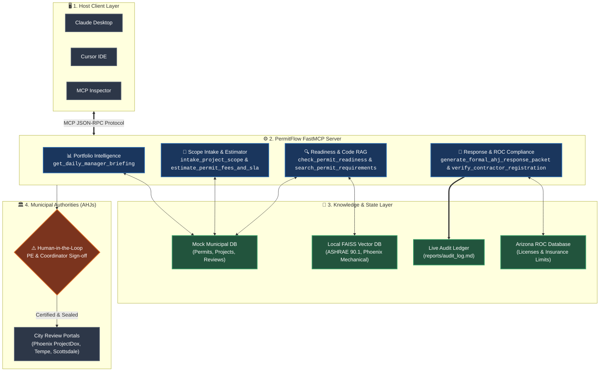

<div align="center">

# 🏛️ PermitFlow MCP Server
### Autonomous Portfolio Permitting Intelligence & Pre-Construction Engine

[](https://www.python.org/)
[](https://docs.astral.sh/uv/)
[](https://modelcontextprotocol.io/)
[](https://github.com/modelcontextprotocol/python-sdk)
[](tests/)
[](LICENSE)

<br/>

> 🎯 **Target Startup**: [PermitFlow](https://www.permitflow.com/) (Y Combinator S22, Series B $54M)  
> 🎓 **Assignment**: Build a Production-Grade MCP Server for a Real Startup  
> 📋 **Interactive Testing Prompts**: [`PERMITFLOW_TESTING_SETS.md`](PERMITFLOW_TESTING_SETS.md)

---

### 📊 System Vital Metrics

| ⚡ Architecture | 📉 Context Efficiency | 🏙️ Target AHJs | 🛡️ Compliance Gate |
| :---: | :---: | :---: | :---: |
| **Autonomous Agent Suite**<br/><sub>(Intake, Research, Audit, Ops)</sub> | **82.9% Token Reduction**<br/><sub>(FAISS Section-Aware RAG)</sub> | **Phoenix, Tempe, Scottsdale**<br/><sub>(Accela & ProjectDox Ready)</sub> | **Human-in-the-Loop**<br/><sub>(PE & Coordinator Sign-off)</sub> |

</div>

---

## ⚡ 1. Interactive System Architecture



---

## 🚀 2. Core Value: Why This MCP Server Exists

Standard AI bots only perform single-field lookups (*"Is permit P-1042 ready?"*).

**PermitFlow MCP delivers Portfolio Intelligence and Pre-Construction Automation**:
* 🌅 **Executive Standup Briefings**: Auto-summarizes overnight changes, SLA deadlines, and urgent blockers before your morning team standup.
* 🚨 **Multi-Factor Risk Ranking**: 0–100 composite risk scoring across active jobs, citing exact examiner comments and missing documents.
* 📋 **Autonomous Scope-to-Permit Intake**: Ingests contractor Scopes of Work (SOWs), determines required trade permits, calculates city fees, and verifies contractor licenses.

> [!TIP]
> **Production Safeguard**: Every submission runbook enforces a mandatory **Human-in-the-Loop** checkpoint before filing to prevent unauthorized municipal submissions.

---

## 🛠️ 3. MCP Tools (8 Core Highlights from 17-Tool Suite)

The PermitFlow MCP server provides **17 tools** in total covering the full municipal permitting lifecycle.

To keep day-to-day operations and evaluation intuitive, here are the **8 most important tools** that power the platform's core workflows:

### 🌟 The 8 Most Important Tools

1. **`get_daily_manager_briefing`** *(Management & Standup)*  
   * **What it does**: Generates a consolidated morning executive summary for permit managers.  
   * **Output**: Portfolio health index, overnight status changes, expiring insurance alerts, and prioritized role-assigned tasks.

2. **`analyze_portfolio_priorities`** *(Risk & Scheduling)*  
   * **What it does**: Scores all active permits (0–100) using multidimensional risk weights (overdue deadlines, plan review rejections, missing documents).  
   * **Output**: Ranked list of critical permits with evidence citations and immediate next steps.

3. **`intake_project_scope`** *(Intake Agent)*  
   * **What it does**: Ingests raw natural-language contractor SOWs, auto-detects municipality from project address, determines required trade permits (mechanical, electrical, plumbing), and checks if Arizona PE stamping is legally required.

4. **`estimate_permit_fees_and_sla`** *(Research Agent)*  
   * **What it does**: Calculates municipal application fees, plan check fees, tech surcharges, and review turnaround SLAs across Phoenix, Scottsdale, Tempe, and Mesa.

5. **`check_permit_readiness`** *(Submission Agent)*  
   * **What it does**: Comprehensive single-permit audit producing a 0–100 readiness score, categorization (`LOW`, `MEDIUM`, `HIGH`, `BLOCKED`), and submission eligibility.

6. **`search_permit_requirements`** *(RAG Knowledge Base)*  
   * **What it does**: Executes semantic search against the local FAISS vector index of building codes (ASHRAE 90.1, Phoenix Mechanical Code Section 301.5, NEC 2023).

7. **`generate_formal_ahj_response_packet`** *(Coordination Agent)*  
   * **What it does**: Generates official city-ready Comment-by-Comment Transmittal Letters resolving examiner plan-check objections with code citations.

8. **`verify_contractor_registration`** *(Compliance & Licensing)*  
   * **What it does**: Audits Arizona Registrar of Contractors (ROC) license standing, bonding, and verifies whether the target municipality is endorsed on the Certificate of Insurance.

---

<details>
<summary><b>📂 Click to view all 17 tools in the complete technical catalog...</b></summary>

<br/>

| Category | # | Tool Name | Operational Purpose |
|:---|:---:|:---|:---|
| **Portfolio Intelligence** | 1 | `get_daily_manager_briefing` | Executive morning standup brief with action matrices |
| | 2 | `analyze_portfolio_priorities` | 0–100 multi-factor portfolio risk scoring & ranking |
| | 3 | `detect_portfolio_changes` | Overnight status transitions and readiness drift |
| | 4 | `analyze_systemic_bottlenecks` | Surfaces cross-project trends (e.g., insurance lapses) |
| **Permit Diagnostics & RAG** | 5 | `check_permit_readiness` | Pre-submission 0–100 audit & Go/No-Go gate |
| | 6 | `find_missing_documents` | Pinpoints missing, unverified, or expired documents |
| | 7 | `search_permit_requirements` | Semantic vector search over building codes (FAISS) |
| | 8 | `explain_permit_blocker` | Root-cause analysis citing examiner comments |
| | 9 | `generate_resubmission_checklist`| Tactical comment resolution checklist |
| **Operational State Management** | 10 | `get_permit_status` | Detailed metadata, revision history, and doc list |
| | 11 | `update_permit_status` | State transition (`submitted`, `approved`, etc.) |
| | 12 | `resolve_authority_comment` | Resolves examiner objections and updates audit ledger |
| | 13 | `update_document_status` | Updates document verification state |
| **Startup Specialized Agents** | 14 | `intake_project_scope` | SOW parsing, city detection, PE stamp detection |
| | 15 | `estimate_permit_fees_and_sla` | Municipal fee calculator & review timeline estimator |
| | 16 | `generate_formal_ahj_response_packet`| Official city transmittal response letter builder |
| | 17 | `verify_contractor_registration` | Arizona ROC license audit & $1M insurance endorsement |

*Also includes **9 MCP Resources** (`portfolio://`, `permit://`, `requirements://`) and **4 MCP Prompts** (`daily_standup_briefing`, `permit_readiness_audit`).*

</details>

---

## 📂 4. Mini Project Structure

```
PermitFlow-MCP/
├── documents/                  # Municipal building codes & local amendments (Phoenix, Tempe)
├── faiss_index/                # Precomputed FAISS vector index & metadata for RAG
├── mock_data/                  # Realistic permit database & ROC contractors
│   ├── permits.json            # Active commercial & residential permits
│   ├── projects.json           # Master development project records
│   ├── documents.json          # Submittal documents and verification states
│   ├── authority_comments.json # Municipal examiner plan check reviews
│   ├── requirements.json       # Jurisdiction requirement matrices
│   └── contractors.json        # Arizona ROC contractor license & insurance registry
├── reports/                    # Live audit ledger & overnight change reports
│   └── audit_log.md            # Real-time transaction audit trail
├── src/permitflow_mcp/         # Core Python FastMCP implementation
│   ├── server.py               # FastMCP server entry point & tool registration
│   ├── config.py               # Configuration management (pydantic-settings)
│   ├── rag/                    # Retriever, embeddings, and text chunking
│   ├── services/               # Core business logic & scoring algorithms
│   ├── tools/                  # 17 MCP tools (portfolio_tools.py, permit_tools.py)
│   ├── resources/              # MCP resources (portfolio://, permit://)
│   └── prompts/                # Standardized AI prompt templates
├── tests/                      # Automated test suite (Pytest - 100% passing)
├── PERMITFLOW_TESTING_SETS.md  # 4 test question sets for evaluation & demonstration
├── pyproject.toml              # Dependencies & build configuration (uv)
└── README.md
```

---

## ⚡ 5. Quick Start (Get Running in 60 Seconds)

<details open>
<summary><b>Step 1: Install with UV</b></summary>

```bash
# Clone repository
git clone https://github.com/rohitbagal1819/PermitFlow-MCP.git
cd PermitFlow-MCP

# Create environment and install dependencies
uv venv
uv sync --all-extras
```
</details>

<details open>
<summary><b>Step 2: Start the Server</b></summary>

```bash
# Standard stdio mode (Claude Desktop / Cursor)
uv run permitflow-mcp

# Or SSE mode (HTTP Server-Sent Events) on port 8000
uv run permitflow-mcp --transport sse --port 8000
```
</details>

<details>
<summary><b>Step 3: Connect to Claude Desktop or Cursor IDE</b></summary>

#### Claude Desktop
Add to your `claude_desktop_config.json`:
```json
{
  "mcpServers": {
    "permitflow-mcp": {
      "command": "uv",
      "args": ["--directory", "d:\\PermitFlow-MCP", "run", "permitflow-mcp"]
    }
  }
}
```

#### Cursor IDE
Add under **Cursor Settings** $\rightarrow$ **Features** $\rightarrow$ **MCP**:
* **Name**: `permitflow-mcp`
* **Type**: `command`
* **Command**: `uv --directory "d:\PermitFlow-MCP" run permitflow-mcp`

</details>

---

## 🧪 6. Interactive Testing & Evaluation Sets

To evaluate this MCP server, we have organized 4 comprehensive testing question sets inside [`PERMITFLOW_TESTING_SETS.md`](PERMITFLOW_TESTING_SETS.md):

<details open>
<summary><b>💬 Click to preview sample test questions you can ask Claude</b></summary>
<br/>

* **Set 1 (Portfolio Intelligence)**:  
  > *"Run the morning standup briefing for our permit portfolio. Which projects are blocked, what changed overnight, and what is our action plan for today?"*  
  *(Triggers: `get_daily_manager_briefing`)*

* **Set 2 (Scope Intake & Estimation)**:  
  > *"We need to replace two 7.5-ton rooftop HVAC units and upgrade the 400A electrical service at 4800 E Camelback Rd, Phoenix, AZ ($185,000 valuation). Intake this project."*  
  *(Triggers: `intake_project_scope` & `estimate_permit_fees_and_sla`)*

* **Set 3 (Readiness & Building Code RAG)**:  
  > *"What does the Phoenix mechanical code require for rooftop equipment over 1,000 lbs, and what are the energy recovery requirements?"*  
  *(Triggers: `search_permit_requirements`)*

* **Set 4 (Licensing & Municipal Transmittals)**:  
  > *"Verify if Ironclad Construction has valid license standing and insurance coverage to pull commercial permits in the City of Phoenix."*  
  *(Triggers: `verify_contractor_registration`)*

</details>

---

## 🏆 7. Assignment Rubric Compliance

| Rubric Rule | Requirement | How It Is Solved in This Server |
| :--- | :--- | :--- |
| **Rule 1: Multi-Host** | Works beyond Claude | Tested across **Claude Desktop**, **Cursor IDE**, and **MCP Inspector**. Strict Pydantic type validation guarantees flawless invocation even on smaller local models. |
| **Rule 2: Workflow Fit** | Fits real-world operations | Positions between architect drawings and municipal portals. Enforces an explicit **Human-in-the-Loop** gate before submitting to AHJs. |
| **Rule 3: Smart with Space** | Context efficiency | Uses section-aware chunking (500 words, 60-word overlap) with FAISS RAG, achieving **82.9% context token reduction** over raw document dumping. |

---

## 📜 License

MIT License. Open-source for education, evaluation, and production extension.
